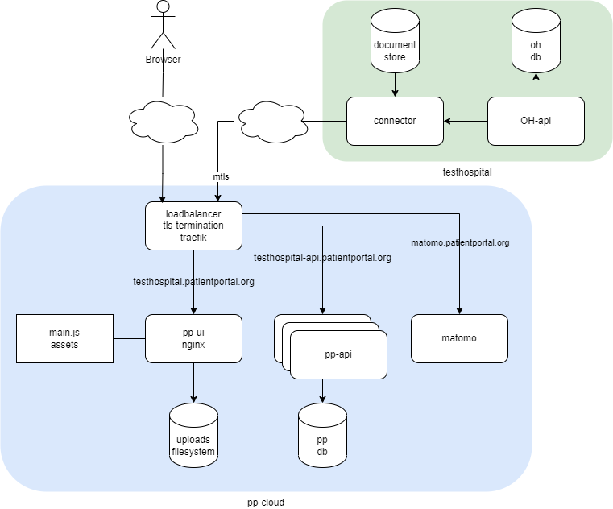

# Open Hospital Patient Portal

The Patient Portal will allow patients to safely and intentionally (informed consent) access their data from outside the hospital that is using [Open Hospital](www.open-hospital.org) software. 

:warning: The current project is a work in progress (WIP) and it **is not ready for production**.

## Components

<div align="center">

</div>

## Instructions

First copy `dotenv` to `.env` and set up your variables and locations.

Add in the `hosts` file the following entry `127.0.0.1 develop.ohpp.local develop-api.ohpp.local develop-matomo.local`

Create the folder structure

```
export $(grep ENVIRONMENT_NAME .env | xargs)
mkdir -p data/$ENVIRONMENT_NAME/database data/$ENVIRONMENT_NAME/database-matomo data/$ENVIRONMENT_NAME/logs/mysql data/$ENVIRONMENT_NAME/logs/mysql-matomo data/$ENVIRONMENT_NAME/logs/nginx data/$ENVIRONMENT_NAME/logs/nginx-matomo data/$ENVIRONMENT_NAME/run data/$ENVIRONMENT_NAME/sql

```


## Building

### 1. build images from sources

```
docker compose -f docker-compose-ops.yaml -f docker-compose.yaml build build-api
```

or launch image from ghcr

```
docker compose -f docker-compose-ops.yaml -f docker-compose.yaml pull api
```

### 2. init DB (only once)

start mysql database/service (in background)

```
docker compose -f docker-compose-ops.yaml -f docker-compose.yaml up -d mysql
```

create file schema + db. Interrupt with CTRL-C after fully started (WARNING: if exits with errors, repeat the command until it is fully started)

```
docker compose -f docker-compose-ops.yaml -f docker-compose.yaml run --rm init-api
```

remove migration file

```
rm -rf data/$ENVIRONMENT_NAME/sql/migrations/*
```

## Starting

### 3. start the app mode with output in the terminal

```
# the portal
docker compose -f docker-compose-ops.yaml -f docker-compose.yaml up loadbalancer api ui

# matomo instance (optional)
docker compose -f docker-compose-matomo.yaml up -d
```

### 4. available services

- Patient Portal (ui) will be available at `https://develop.ohpp.local/` 

- Api will be available at `https://develop-api.ohpp.local/` and `http://localhost:18080/`

- Loadbalancer dashboard (traefik) will be available at `http://localhost:8080`

- Matomo will be available at `http://develop-matomo.ohpp.local/` and `http://localhost:28080/`

    - connect and configure the first time (installation)
    - In Administration > Privacy > Users opt-out, under “Support Do Not Track preference” disable Do Not Track support
    
## Stopping

### 5. stop all containers

Interrupt with CTRL-C

```
docker compose -f docker-compose-matomo.yaml stop
docker compose -f docker-compose-ops.yaml -f docker-compose.yaml stop
```

### Cleaning

Remove all containers and volumes

```
docker compose rm --stop --volumes --force
docker compose -f docker-compose-matomo.yaml rm --stop --volumes --force
docker volume rm $(docker volume ls --format '{{.Name}}' | grep ${PWD##*/})
```

Clean previous data

```
rm -rf data/$ENVIRONMENT_NAME
```

## Developing

### API

Api available at `https://develop-api.ohpp.local/` and `http://localhost:18080/`

Swagger UI available at `https://develop-api.ohpp.local/swagger-ui/` and `https://develop-api.ohpp.local/v3/api-docs`

- See ppoh.postman_collection.json

### Develop the ui (React)

Just cd into patient-portal-ui and run (ui available at http://localhost:3000/)

```
npm install
npm start
```

Codebase in patient-portal-ui/src

## Connector (WIP)

A scaffolding for the connector that will retrieve data from an Open Hospital instance (DB) and feed the Patient Portal DB

It uses [openhospital-core](https://github.com/informatici/openhospital-core.git) and it expects the OPENHOSPITAL_CORE_VERSION to point a tagged version

### 1. Setup using a test db

First create connector settings based on .env

```
make
```

Get db scripts from https://github.com/informatici/openhospital-core.git $OPENHOSPITAL_CORE_VERSION

```
rm -rf deps
export $(grep OPENHOSPITAL_CORE_VERSION .env | xargs)
mkdir deps && pushd deps && git clone --depth=1 -b v$OPENHOSPITAL_CORE_VERSION https://github.com/informatici/openhospital-core.git && popd

```

Start the database container with:

```
docker compose -f docker-compose-connector.yml up -d database
```

Install demo data with:

```
docker compose -f docker-compose-connector.yml run oh-database-init
```

### 2. Build from sources

```
docker compose -f docker-compose-connector.yml build connector
```

### 3. Start the connector with the output in the terminal

```
docker compose -f docker-compose-connector.yml up connector
```

### 4. Using a production db

You can setup the connector to use an existing Open Hospital DB with real data

In docker-compose-connector.yml, comment:

```
#    networks:
#      - hospital-net
```

and uncomment:

```
    network_mode: host
```

In `.env` set up variables in `[oh connector]` section then run `make`


Rebuild and start with `docker compose -f docker-compose-connector.yml up --build connector`
